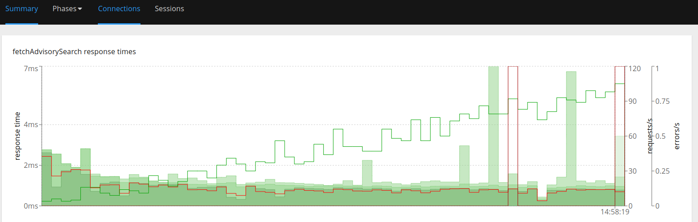
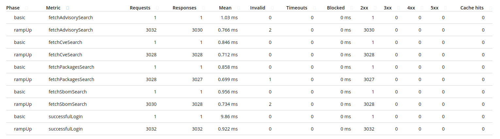

# Basic benchmarks with hyperfoil (in-vm) and Trustification (stable - running locally)

* Clone the repository
* Switch to stable branch `git checkout stable`
* Open a terminal and run [stable containerized version](https://github.com/trustification/trustification/tree/stable?tab=readme-ov-file#running-locally)
* Open other terminal and run hyperfoil:

```shell
cd benchmarks
./get-hyperfoil.sh
cd hyperfoil*/
./bin/cli.sh
```

Run the following commands:

```shell
start-local
upload ../trustification/trustification-hf.yml
run
stats
```

We can see something like:

```shell
[hyperfoil]$ start-local
Starting controller in default directory (/tmp/hyperfoil)
Controller started, listening on 127.0.0.1:42637
Connecting to the controller...
Connected to 127.0.0.1:42637!
[hyperfoil@in-vm]$ upload ../trustification/trustification-hf.yml
Loaded benchmark trustification, uploading...
... done.
[hyperfoil@in-vm]$ run
Started run 0003
Run 0003, benchmark trustification
Agents: in-vm[STOPPED]
Started: 2024/06/03 10:39:30.920    Terminated: 2024/06/03 10:40:30.925
NAME    STATUS      STARTED       REMAINING  COMPLETED     TOTAL DURATION               DESCRIPTION
basic   TERMINATED  10:39:30.920             10:39:30.954  34 ms (exceeded by 35 ms)    1 users at once
rampUp  TERMINATED  10:39:30.920             10:40:30.925  60005 ms (exceeded by 5 ms)  1.00 - 100.00 users per second
[hyperfoil@in-vm]$ stats
Total stats from run 0003
PHASE   METRIC               THROUGHPUT   REQUESTS  MEAN       p50        p90        p99       p99.9     p99.99    TIMEOUTS  ERRORS  BLOCKED  2xx   3xx  4xx
                             5xx          CACHE
----------------------------------------------------------------------------------------------------------------------------------------------------------------
basic   fetchAdvisorySearch  29.41 req/s         1    1.21 ms    1.21 ms    1.21 ms   1.21 ms   1.21 ms   1.21 ms         0       0     0 ns     1    0    0
                                       0         0
----------------------------------------------------------------------------------------------------------------------------------------------------------------
basic   fetchCveSearch       29.41 req/s         1    1.14 ms    1.15 ms    1.15 ms   1.15 ms   1.15 ms   1.15 ms         0       0     0 ns     1    0    0
                                       0         0
----------------------------------------------------------------------------------------------------------------------------------------------------------------
basic   fetchPackagesSearch  29.41 req/s         1    1.08 ms    1.08 ms    1.08 ms   1.08 ms   1.08 ms   1.08 ms         0       0     0 ns     1    0    0
                                       0         0
----------------------------------------------------------------------------------------------------------------------------------------------------------------
basic   fetchSbomSearch      29.41 req/s         1    1.05 ms    1.06 ms    1.06 ms   1.06 ms   1.06 ms   1.06 ms         0       0     0 ns     1    0    0
                                       0         0
----------------------------------------------------------------------------------------------------------------------------------------------------------------
basic   successfulLogin      29.41 req/s         1   11.37 ms   11.40 ms   11.40 ms  11.40 ms  11.40 ms  11.40 ms         0       0     0 ns     1    0    0
                                       0         0
----------------------------------------------------------------------------------------------------------------------------------------------------------------
rampUp  fetchAdvisorySearch  50.25 req/s      3019  572.55 μs  397.31 μs    1.09 ms   2.70 ms   5.41 ms   8.65 ms         0       4     0 ns  3015    0    0
                                       0         0
----------------------------------------------------------------------------------------------------------------------------------------------------------------
rampUp  fetchCveSearch       50.20 req/s      3015  511.91 μs  366.59 μs  995.33 μs   2.52 ms   3.93 ms   5.34 ms         0       3     0 ns  3012    0    0
                                       0         0
----------------------------------------------------------------------------------------------------------------------------------------------------------------
rampUp  fetchPackagesSearch  50.18 req/s      3012  506.41 μs  362.50 μs  946.18 μs   2.70 ms   4.26 ms   6.23 ms         0       1     0 ns  3011    0    0
                                       0         0
----------------------------------------------------------------------------------------------------------------------------------------------------------------
rampUp  fetchSbomSearch      50.25 req/s      3015  519.83 μs  368.64 μs  983.04 μs   2.47 ms   3.93 ms   6.26 ms         0       0     0 ns  3015    0    0
                                       0         0
----------------------------------------------------------------------------------------------------------------------------------------------------------------
rampUp  successfulLogin      50.31 req/s      3019  752.45 μs  569.34 μs    1.32 ms   3.41 ms   6.65 ms  11.53 ms         0       0     0 ns  3019    0    0
                                       0         0
----------------------------------------------------------------------------------------------------------------------------------------------------------------
[hyperfoil@in-vm]$
```

Now run the `report` command:

```shell
[hyperfoil@in-vm]$ report --destination=/whatever_dir_here
```

A browser will pop up and show this:

(you can visualize more options on browser report)




