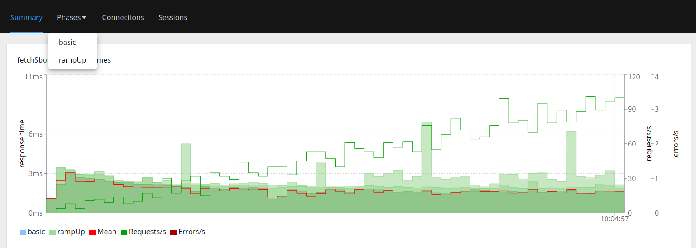
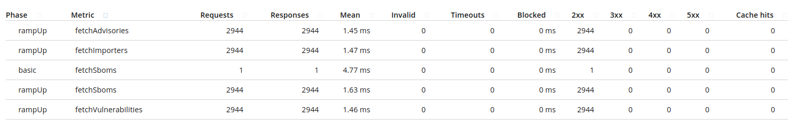

# Basic benchmarks with hyperfoil (in-vm) and Trustify (PM-mode)

* Open a terminal and run PM-mode with **UI** `cargo run --bin trustd`
* Open other terminal and run hyperfoil:

```shell
cd benchmarks
./get-hyperfoil.sh
cd hyperfoil*/
./bin/cli.sh
```

Run hyperfoil commands:

```shell
start-local
upload ../trustify/pm-mode-hf.yml
run
stats
```

We can see something like:

```shell
[hyperfoil]$ start-local
Starting controller in default directory (/tmp/hyperfoil)
Controller started, listening on 127.0.0.1:35863
Connecting to the controller...
Connected to 127.0.0.1:35863!
[hyperfoil@in-vm]$ upload ../trustify/pm-mode-hf.yml
Loaded benchmark pm-mode, uploading...
... done.
[hyperfoil@in-vm]$ run
Started run 0000
Run 0000, benchmark pm-mode
Agents: in-vm[STOPPED]
Started: 2024/06/03 10:03:58.716    Terminated: 2024/06/03 10:04:58.725
NAME    STATUS      STARTED       REMAINING  COMPLETED     TOTAL DURATION               DESCRIPTION
basic   TERMINATED  10:03:58.716             10:03:58.729  13 ms (exceeded by 14 ms)    1 users at once
rampUp  TERMINATED  10:03:58.716             10:04:58.725  60009 ms (exceeded by 9 ms)  1.00 - 100.00 users per second
[hyperfoil@in-vm]$ stats
Total stats from run 0000
PHASE   METRIC                THROUGHPUT   REQUESTS  MEAN     p50      p90      p99      p99.9    p99.99   TIMEOUTS  ERRORS  BLOCKED  2xx   3xx  4xx  5xx  CACHE
basic   fetchSboms            76.92 req/s         1  4.77 ms  4.78 ms  4.78 ms  4.78 ms  4.78 ms  4.78 ms         0       0     0 ns     1    0    0    0      0
rampUp  fetchAdvisories       49.06 req/s      2944  1.45 ms  1.48 ms  2.06 ms  2.82 ms  3.75 ms  7.57 ms         0       0     0 ns  2944    0    0    0      0
rampUp  fetchImporters        49.06 req/s      2944  1.47 ms  1.48 ms  2.10 ms  2.67 ms  4.65 ms  5.83 ms         0       0     0 ns  2944    0    0    0      0
rampUp  fetchSboms            49.06 req/s      2944  1.63 ms  1.69 ms  2.07 ms  2.85 ms  5.28 ms  6.91 ms         0       0     0 ns  2944    0    0    0      0
rampUp  fetchVulnerabilities  49.06 req/s      2944  1.46 ms  1.49 ms  1.97 ms  2.64 ms  3.41 ms  5.67 ms         0       0     0 ns  2944    0    0    0      0
```

Now run the `report` command:

```shell
[hyperfoil@in-vm]$ report --destination=/whatever_dir_here
```

A browser will pop up and show this:

(you can visualize more options on browser report)




